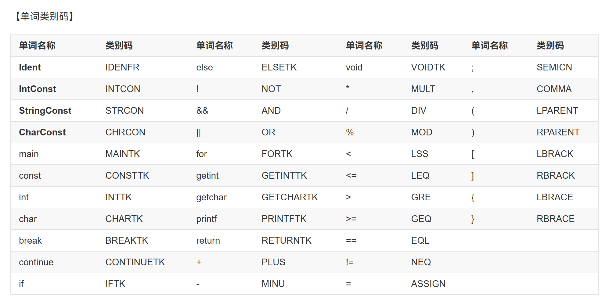
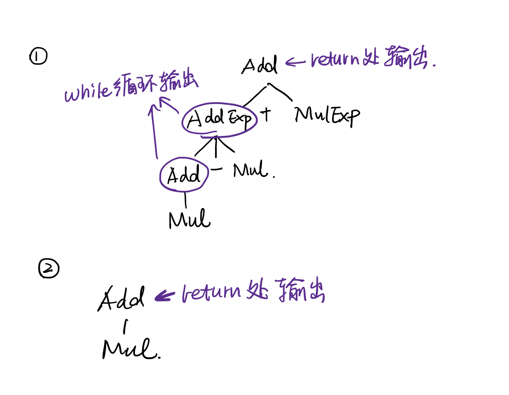
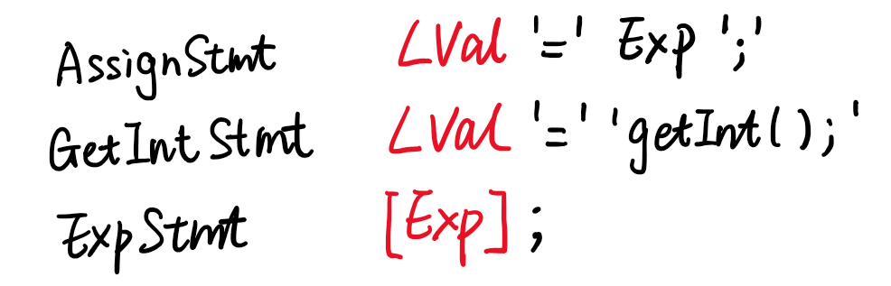
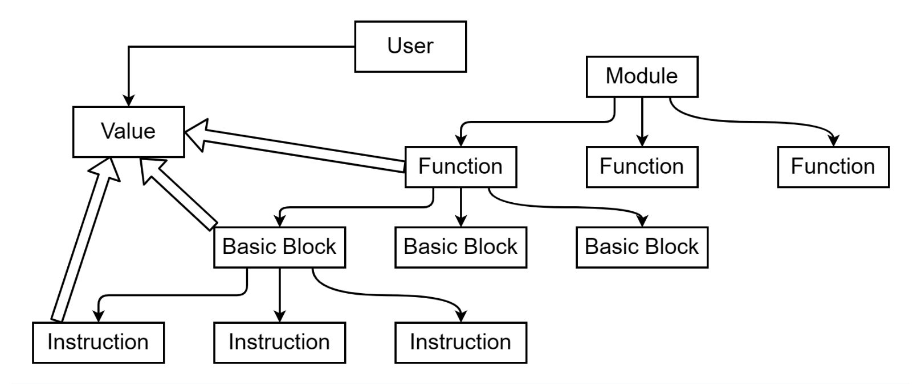
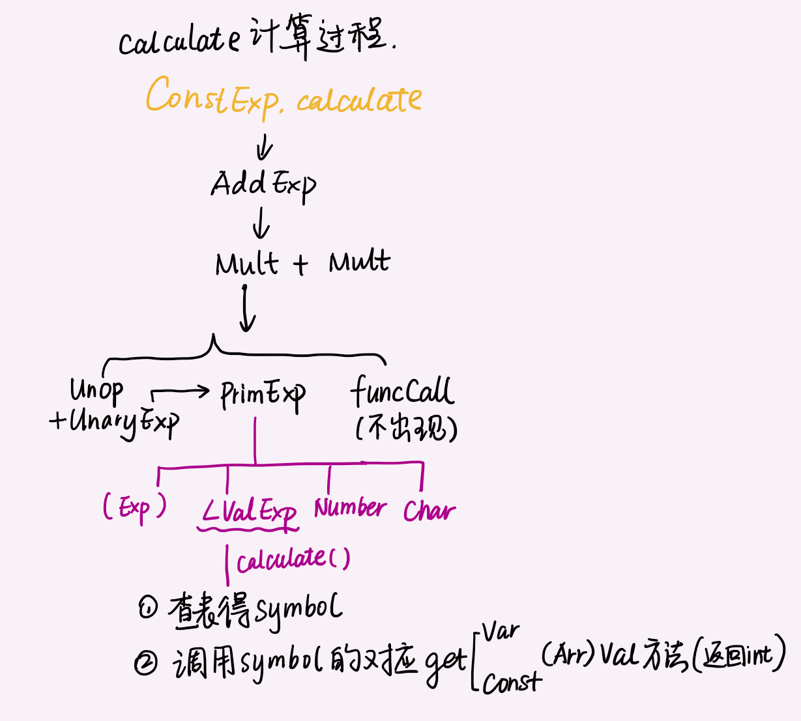

[TOC]

# BUAA_2024_Compiler

### TODO

- int和char的类型转换
- 

## 参考编译器介绍


## 总体设计


## 词法分析

#### 具体实现

新建枚举类`TokenType`用于表示如下单词类别（关键字+标识符名称）。



新建Token类，作为词法基本单元。记录了单词类别`TokenType`，单词值`value`（`String`），以及行号 `lineno`。

新建Lexer类，其中`curChar`记录当前字符。规定永远提前读一个字符，即`curChar`是下一个要进行分析的字符。

Lexer内成员变量`tokenList`按顺序存储每个读到的Token。`getTokenList()`方法用于获取单词列表`tokenList`。

```java
public ArrayList<Token> getTokenList() throws IOException {
    if (tokenList.isEmpty()) {
        Token tk = next();
        while (tk.getTokenType() != TokenType.EOFTK) {
            tokenList.add(tk);
            tk = next();
        }
    }
    return tokenList;
}
```

新建TokenStream类，最后将得到的单词列表封装成一个TokenStream的实例。TokenStream提供了以单词为最小单位进行读取的read接口供后续语法分析使用。

#### `next()`方法

`next()`尝试解析出下一个Token并返回。

## 语法分析

我的`parser`采用递归下降的思路构建抽象语法树，为每一种语法成分写一个`parseXXX`函数，从顶层`parseCompUnit`开始，判断前方为该语法成分时调用，返回该语法节点。

#### 改写部分文法

##### 精简文法

由于不要求输出`BlockItem,Decl,BType`这三种语法成分，且此三类的产生式也很简单，因此将这三种语法成分先与其他合并，例如：

```
CompUnit → {Decl} {FuncDef} MainFuncDef
改为：CompUnit → {ConstDecl | VarDecl} {FuncDef} MainFuncDef

语句块 Block → '{' { BlockItem } '}
改为：Block → '{' { ConstDecl | VarDecl | Stmt } '}'
```

##### 消除左递归

由于左递归会导致程序进入死循环，需要改写含有左递归的文法。使用扩展巴科斯范式（EBNF）进行如下改写即可：

```
AddExp → MulExp | AddExp ('+' | '−') MulExp
改为：AddExp → MulExp { ('+' | '−') MulExp }
```

不过这里需要注意：由于我使用while循环解析第二个MulExp及之后的MulExp，但原来的文法中只有最右边的`MulExp`被认为是`MulExp`，其他的实际上套了一层`AddExp`的壳，所以在while循环需要加上一个AddExp语法成分的输出。大概如下：

```java
children.add(parseMulExp());
while (curToken.getTokenType() == tokenType.PLUS || curToken.getTokenType() == tokenType.MINU) {
    Printer.printSynVarType(SyntaxVarType.ADD_EXP);
    children.add(NodeCreator.createNode(curToken)); read(); // + / -
    children.add(parseMulExp());
}
```



##### `Stmt`的处理

由于语句类有太多种情况，因此为每一种语句单独设置一个类继承`Stmt`，再由`Stmt`继承`Node`。

#### 提前读

在提完公因子之后还有FIRST集合的冲突的情况，使用**提前读**若干`token`的策略，直到遇到可以判定的词法成分。使用的是`tokenStream`的`look`函数：

```java
public Token look(int n) {
    if (pos + n < tokenList.size())
        return tokenList.get(pos + n);
    else return null;
}
```

例如，一元表达式 UnaryExp → PrimaryExp | **Ident** '(' [FuncRParams] ')' | UnaryOp UnaryExp，其中PrimaryExp->LVal的FIRST集也包含**Ident**，此时就采用提前读的策略，具体如下：

```java
if (curToken.getTokenType() == tokenType.IDENFR &&
        tokenStream.look(1).getTokenType() == tokenType.LPARENT) {
    // parse Funccall
}
else if (isUnaryOp()) {
    children.add(parseUnaryOp());
    children.add(parseUnaryExp());
}
else { // PrimaryExp
    children.add(parsePrimaryExp());
}
```

对于常用的FIRST集合整理成函数，例如`Exp`的FIRST集：`+, -, !, 标识符, (, int, char`。


#### 回溯

但是，仍有一种情况无法使用提前读来解决，需要读完下图红色部分之后才能进一步判断，这里通过提前读+回溯来解决。


具体地，`parseStmt`方法中判断完所有First集合不冲突的情况后：

- 记录当前`curToken`的位置`pos`
- 解析一个`exp`
- 判断解析完`exp`之后当前符号是否为`=(ASSGIN)`，这时所有情况便可以区分开来。
- 回到记录位置`pos`重新解析。

#### 抽象语法树（AST）结构

新建语法成分枚举类`SyntaxVarType`，对应给出文法的每一种非终结符，对于所有终结符创建一个新的`TOKEN`枚举类型。

根据题目给出的文法，为每个产生式左侧的语法成分各建立一个类，均继承自基类`Node`，记录的是语法成分的种类和其孩子节点。主要分为以下两种：

- **词法**成分节点：其成分是词法分析给出的`tokenStream`中的单个`token`，`children`为空，等价为终结符，是语法树中的叶子节点。
- **语法**分析节点：文法中给出的所有非终结符，是语法树中的非叶子节点。

每当递归下降子程序解析完某一语法成分，即可调用相应的`Node`的子类新创建语法树节点。在实现上使用了工厂模式生成两种`Node`。同时工厂模式产生新节点这一步进行输出，即可保证输出顺序和解析顺序的一致性。

##### 与lexer的配合

从lexer传来的是token流，parser使用curToken记录当前单个词法成分。采取的读取规范是预先读好一个token，即在解析下一个语法成分前，其第一个词法成分已经存储在curToken里了。

## 语义分析

#### 类型系统

新建符号类`Symbol`作为所有类型的父类，使用继承区分不同的符号。

新建枚举类`SymbolType`用于区分该符号是变量/常量/函数类型。

新建枚举类`ReturnType`用于函数的返回值（`int/char/void`）

#### 创建符号表

符号表类 `SymbolTable` 对应某一作用域的符号表。

##### 符号表的组织

进入新作用域时，调用 `pushScope` 函数，该函数主要负责：新建一个符号表并将其入栈。

离开作用域时，我们调用 `popScope` 函数，返回上一层作用域的符号表，即 `_father` 字段取值。

### 如何打印

词法成分：Token的`toString()`方法：`<tokenType> <value> \n` ，自带换行。例：`LPARENT ( \n`， `IDENFR num \n`

语法成分：`SyntaxVarType`的`toString`方法：`"<" + typeName + ">\n"`

## 中间代码生成

这一部分的目标是：根据语法、语义分析生成的AST构建出LLVM IR。

### LLVM构建单元



#### Module

一个`.c`/`.cpp`文件是一个编译单元；一个`.ll`文件对应一个`Module`。由若干`GlobalValue`构成，其中GV可以是：全局变量/函数。

#### BasicBlock 基本块

理论课所讲的基本块，而非大括号括起来的、语法成分`Block`。

基本块的划分：

- `{}` ：**`Block`语法成分**的第一个语句为基本块的第一条语句。（eg. 函数定义的`{}`，函数体内部的`Block`）
- `BasicBlock` **以 terminator instruction（`ret`、`br` 等）结尾**。

#### Value类

对于模块中不同粒度的所有语法结构，将都作为 `Value` 类的子类。

#### User类

特殊的`Value`类，为了表达 `Value` 之间的引用关系，将其他 `Value` 作为参数。

#### Instruction类

继承自`User`，因此可以将其他`Value`作为参数

#### Use类

表示语法结构间的使用关系。`User` 和 `Value` 之间的配对用 `Use` 类记录，通过 `Use` 类建立起了语法结构的上下级关系双向索引。

####  LLVM 的类型系统

每个Value都有其对应的类型。其子类包括：IntType

### 各语法成分的具体实现

#### 全局变量

```
常量声明 ConstDecl → 'const' BType ConstDef { ',' ConstDef } ';'
常量定义 ConstDef → Ident [ '[' ConstExp ']' ] '=' ConstInitVal (如果使用了Ident必须是常量)
```

- 

#### 局部变量

> 与全局变量不同，局部变量在赋值前需要**申请一块内存**。
> 申请内存需要使用`Alloca`指令，其返回值是一个对应类型的指针（如果是非数组，就返回INT32/8的指针，如果是数组就返回`ArrayType`的指针）。
>
> 为对象分配完内存后，如果有初始值，就可以使用`store`指令将初始值存入那块内存。
> `store i32 %1, i32* %3`，意思是把`from`保存的值，存入`to`这一内存地址（例如`alloca`）。
>
> 当我们需要访问一个对象，就需要从对应内存中读取数据，`load`指令格式为`%6 = load i32, i32* %4`，`type`是这块地址上的对象类型，逗号后是指针（可以是`alloca`指令或`GlobalVar`）。打印的是指针的类型+指针的`name`。
>

```
; int b = a;
%1 = alloca i32, align 4 ; %1 是为b分配的地址空间
%2 = load i32, i32* @a, align 4 ; 加载全局变量a的Value至寄存器%2中
store i32 %2, i32* %1, align 4 ; 将寄存器%2的值存入寄存器%1表示的地址中
```

#### 变/常量定义（Var/ConstDef）

对应`generateIR`方法：

1. 实时更新全局`curSymbolId`
2. 设置`symbol`的`llvmType`属性。
3. `symbol`的`InitInfo`属性：
   - 对于全局变量/常量，设置`symbol.InitInfo`属性。
     - 如果有`=`为其赋值，`InitInfo`中的`InitValues`字段为一个初值数组。特别地，如果是字符串为char数组赋值，对应`str`不为`null`，而是对应长度（补完`\0`）的字符串。
     - 如果未赋值，`InitInfo`中的`InitValues`字段为`null`。
   - 对于局部变量，其初始值无法直接计算，其`symbol.InitInfo = null`。
4. 设置`symbol`的`llvmValue`属性。
   - 全局变量是其`globalVar`。
   - 局部变量是`Alloca`指令的实例。

##### 关于赋初值

新建`InitInfo`类，为**全局**变/常量赋初值时使用。

> ConstExp中使用的标识符必须是普通常量，不包括数组元素、函数返回值。
>
> 
>
> 对于任何有初始值的**字符数组**，无论是否用字符串去初始化，都是需要补0的。
>
> **唯一不需要**编译器置0的情况只有**局部变量int数组部分初始化。**
>
> **测试数据保证不会对未初始化的数组元素进行访问。**

```java
public class InitInfo {
    // 这里的Initial特指编译时就能计算出结果（Int）的初始值
    // 包括全局变量 全局常量 局部常量
    private LLVMType llvmType;
    private ArrayList<Integer> initValue;
    private String initString;
}
```

#### 常量的计算

`constExp`是可以直接算到具体的数字的，例如全局变量、常量赋值，数组声明中的N，**最多涉及从表中得到该常量的具体数值**而不涉及存取指令。`Node`新增了`calculate()`方法返回`int`，用于计算常量的初始值。



#### 虚拟寄存器命名


#### 函数

##### 函数定义

对应`generateIR`方法：

为函数定义生成中间代码主要包括以下几步：

1. 新建`Function`并设为`FuncSymbol`的`llvmValue`。

2. 遍历参数表，为每一个参数生成一个`Param`设置为符号的`llvmValue`。对于符号的`llvmType`，**如果参数是数组，`llvmType`将是一个指向数组元素类型（int32/8）的指针**，否则就是元素的正常类型。

3. **新建**`BasicBlock`+在`IRManager`中**更新**`curBlock`为当前`Block`

4. 为**参数**生成所需要的中间代码。具体地，为该参数对应的`varSymbol`设置`llvmValue`。如果是数组，`llvmValue`就是`param`；**如果是非数组，需要复制形参信息，要新`alloc`一块新内存并将`param`作为`from`存入**。

5. 调用`Block`生成中间代码


当数组作为LVal被访问时，我们取出它的`varSymbol`。这个`varSymbol`如果是普通变量，就会是一个指向整个数组的指针；如果是函数形参对应的`param`，就会是一个指向`INT32/8`的指针。

##### 函数调用

其中`retType`可以是`int32`，`int8`， `void`

```java
public class Function extends User {
    private LLVMType retType;
    private ArrayList<Param> params;
}
```

#### 输入输出

```javascript
%3 = call i32 @getint()
```

#### 数组

```c
// 局部变量
int arr[5] = {1, 2, 3};
const int arr1[5] = {1, 2, 3};

char ch[10] = "hello"; // 剩下的需要置0
const char ch1[10] = "hello";
```

##### GEP指令


#### 条件语句

==todo== return之后是否要新建BB

##### `if`语句的实现

生成3个基本块：`trueBlock`，`falseBlock`，`followBlock`

生成`condExp`的中间代码

当前块设为`trueBlock`，生成`if`成立时的中间代码，最后补上无条件`Jump`至`follow`指令。

当前块设为`falseBlock`，生成`if`不成立时的中间代码，最后补上无条件`Jump`至`follow`指令。

设置当前块为`followBlock`。


### 符号表的维护

##### 如何在genIR中使用符号表

同语义分析一样，中间代码生成也需要遍历语法树并获取符号表相关信息。我没有选择重建符号表，而是直接使用已建好的表的信息。


1.在**语义分析阶段**对**变量或常量**会生成对应的`Symbol`（在变量定义或函数形参定义）。如果加入符号表成功，就为该`Symbol`赋一个全局唯一标识`symbolId`（从1开始递增）。

```java
public boolean addSymbol(Symbol symbol) { // SymbolTable.java
    // 如果符号创建成功
    if (!(symbol instanceof FuncSymbol))
        symbol.setSymbolId(SYMBOL_ID++);
    // 加入符号表的操作
    return true;
}
```

2.中间代码生成阶段，设置全局变量`curSymbolId`记录此时定义到了哪个变量。每当遍历到变量定义（`VarDef`或`FuncFParam`）时将`curSymbolId`更新为当前变量的`id`。

3.每当进入**`Block`语法成分**，**更新**当前符号表为这个Block对应的符号表。退出这个块时更新当前符号表为此Block对应符号表的父亲表。

##### 符号表中记录的信息

`FuncSymbol curFuncSymbol`：用于对`return`语句错误检查，以及`genIR`阶段获取函数返回值类型。

### 关于类型转换

##### Value的返回值设置

`Char`返回`i8`

对于等号右边的表达式：

- 如果涉及二元运算（`binaryInstr`）返回一定是i32
- `UnaryExp`中的：无论是有`UnaryOp`中的`+`，单个`Char`返回`i8`，非运算`!`返回`i1`。

##### 类型转换判断点

`StoreInstr`：如果两个Int类型不一样，就将`from`转为和`to`一样的类型。

`PutIntInstr`/`PutChInstr`：如果不是`Int32`就转为`Int32`。

`ReturnInstr`：如果返回的`Value`和函数定义处返回值不一样就转为后者。

`BinInstr`： 如果有操作数不是`i32`就转。

### 没有设置Name的指令

`store`，`ret`

### 注意

#### 转义

转义可能出现在`StringConst`和`Char`中。

对于`StringConst`，其字符串的内容在**词法分析**封装为`Node`的时候就将`\`和其后共两个字符替换为**对应的转义字符**。只需在`InitInfo`和`StringLiteral`处的`toString`方法将其替换为llvm所需的输出即可。

## 目标代码（Mips）生成

### Instr指令的翻译

#### `allocaInstr`

```assembly
# %v0 = alloca i32 这条指令实际上是返回一个指针，由于指针的值必须是一个地址
# 所以要先分配一个内存(sp-4)，让这个指针变量的值等于新分配变量x的地址
addi $k0 $sp -4 # x的值存储在地址为sp-4的地方
sw $k0 -8($sp) # 这条指令的返回值是v0, 也就是变量x的地址(sp-4)，它存储在sp-8的地方，并在MM中有<alloca_for_v0, -8>的记录
```

llvm格式：`%pointer = alloca i32`

1. 为新分配的变量分配内存（push sizeof type）
2. 获得这块内存的首地址
3. 为指针变量本身分配内存（push stack frame with size 4）
4. 将内存首地址存入，并在MipsManager中加入记录。

#### `storeInstr`

```assembly
# store i32 3, i32* %v0
lw $k1 -8($sp) # v0的地址加载到k1寄存器
li $k0 3
sw $k0 0($k1) # 把$k0中的值存到k1寄存器中的地址上
```

llvm格式：`store %from, %to`，注意to是指针（alloca，GlobalVar等）

1. 获取from的值，存到`$k0`寄存器中
2. 获取目标存入地址，将to这个指针的值存入`$k1`寄存器中
3. 生成sw指令，将`$k0`的值存储到`$k1`上的地址

#### `loadInstr`

```assembly
# %v3 = load i32, i32* %v0 # 把v0这个地址上存的值赋给v3
lw $k0 -8($sp) #k0存储v0的地址
lw $k0 0($k0) # 根据v0的地址:0($k0) 访存得到v0的值，再存入k0
sw $k0 -20($sp)
# load 的返回值是v3变量，是一个i32类型
# 将k0的值(load得到的值)存回v3的地址，使得内存中v3的地址上的那块值真的变了
# 为v3在内存中开辟一个4Bytes空间(vsp-20),并将其值(k0)存入
```

#### 函数调用

1. 复制sp和ra的值到栈中
2. 从子函数的栈底开始，将形参的值复制到子函数的栈帧中
3. 更新sp至子函数栈底，jal
4. 还原ra和sp的值
5. 将v0中保存的返回值复制到栈中

#### Func

#### 犯过的错

- data段为.word和.asciiz定义的变量名重复了
- 

## todo

### ==关于符号位==

### 附录

#### StringBuilder的用法

```java
StringBuilder sb = new StringBuilder("Hello");
sb.append("World"); // 输出 "HelloWorld"
sb.insert(5, " "); // 输出 "Hello World"
sb.replace(6, 11, "Java");// 输出 "Hello Java"
sb.delete(5, 6);  // 删除索引 5 到 6 之间的字符（删除空格）
sb.reverse(); //  "avaJlleH"
sb.setCharAt(0, 'h'); // 输出 "havaJlleH"
```

```java
Pattern patternHexcon = Pattern.compile("0[Xx][0-9a-fA-F]+");
Matcher matcher = patternHexcon.matcher("0x123");
if (matcher.matches()) {
            
}
"[+-]?[0-9]+"; // intconst, + 匹配1次或多次
"[a-zA-Z_][a-zA-Z0-9_]*"; // keywords or ident， *匹配0次或多次
```


#### 添加的部分

lexer：

新增TokenType种类（关键字）
修改next方法
新增的关键字在getIdentType中体现

parser：

新增SyntaxVarType种类
新增相关类，NodeCreator新增对应new
parser新增对应parse方法
更改可能改变的**First集**，更改相关的if判断

#### 测试

```assembly
main:
b0:
# int x;
# %v0 = alloca i32 这条指令实际上是返回一个指针，由于指针的值必须是一个地址
# 所以要先分配一个内存(sp-4)，让这个指针变量的值等于新分配变量x的地址
# 关心的是v0这个地址，它保存在地址为sp-8的地方
addi $k0 $sp -4 # x的值存储在地址为sp-4的地方
sw $k0 -8($sp) # x的地址(sp-4) == v0的值 存储在sp-8的地方，并在MM中有<alloca_for_v0, -8>的记录

# store i32 3, i32* %v0
lw $k1 -8($sp) # v0的地址加载到k1寄存器
li $k0 3
sw $k0 0($k1) # 把$k0中的值存到k1寄存器中的地址上

# %v2 = alloca i32 # v2 == y
addi $k0 $sp -12 # v2的值存在sp-12这个地址上
sw $k0 -16($sp) # v2的地址存在sp-16这个地址上

# %v3 = load i32, i32* %v0 # 把v0这个地址上存的值赋给v3
lw $k0 -8($sp) #k0存储v0的地址
lw $k0 0($k0) # 根据v0的地址:0($k0) 访存得到v0的值，再存入k0
sw $k0 -20($sp)
# load 的返回值是v3变量，是一个i32类型
# 将k0的值(load得到的值)存回v3的地址，使得内存中v3的地址上的那块值真的变了
# 为v3在内存中开辟一个4Bytes空间(vsp-20),并将其值(k0)存入

# store i32 %v3, i32* %v2
lw $k1 -16($sp)
lw $k0 -20($sp)
sw $k0 0($k1)

# ret i32 0
li $v0 0
jr $ra
end:
```

